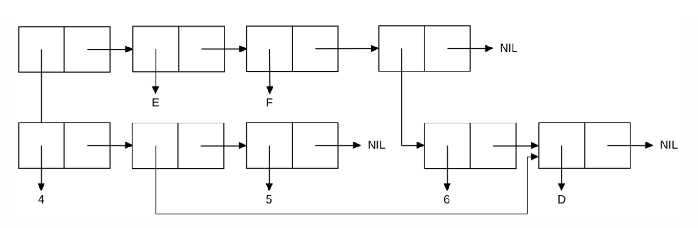

<p align="center"><b>МОНУ НТУУ КПІ ім. Ігоря Сікорського ФПМ СПіСКС</b></p>
<p align="center">
<b>Звіт з лабораторної роботи 1</b><br/>
"Обробка списків з використанням базових функцій"<br/>
дисципліни "Вступ до функціонального програмування"
</p>
<p align="right">
    <strong>Студентка</strong>: <em><strong>Саюн Дарина Миколаївна</strong></em>
</p>
<p align="right">
    <strong>Група</strong>: <em><strong>КВ-13</strong></em>
</p>
<p align="right">
    <strong>Рік</strong>: <em><strong>2024</strong></em>
</p>


## Загальне завдання
1. **Створіть список з п'яти елементів**, використовуючи функції `LIST` і `CONS`. Форма створення списку має бути одна — використання `SET` чи `SETQ` (або інших допоміжних форм) для збереження проміжних значень не допускається.
   Загальна кількість елементів (включно з підсписками та їх елементами) не має перевищувати 10-12 шт. (дуже великий список робити не потрібно).
   Збережіть створений список у якусь змінну з `SET` або `SETQ`. Список має містити (напряму або у підсписках):
   - хоча б один символ
   - хоча б одне число
   - хоча б один не пустий підсписок
   - хоча б один пустий підсписок

```lisp
CL-USER> (set 'a (cons '(1 2) (list 'b '() 3 '(4 c))))
((1 2) B NIL 3 (4 C))
CL-USER> a
((1 2) B NIL 3 (4 C))
```
2. Отримайте голову списку.
```lisp
CL-USER> (car a)
(1 2)
```
3. Отримайте хвіст списку.
```lisp
CL-USER> (cdr a)
(B NIL 3 (4 C))
```
4. Отримайте третій елемент списку.
```lisp
CL-USER> (third a)
NIL
```
5. Отримайте останній елемент списку.
```lisp
CL-USER> (nth 4 a)
(4 C)
```
6. Використайте предикати `ATOM` та `LISTP` на різних елементах списку (по 2-3
приклади для кожної функції).
```lisp
CL-USER> (atom (first a))
NIL
CL-USER> (atom (third a))
T
CL-USER> (atom (second (nth 4 a)))
T
CL-USER> (listp (first a))
T
CL-USER> (listp (second a))
NIL
CL-USER> (listp (nth 4 a))
T
```
7. Використайте на елементах списку 2-3 інших предикати з розглянутих у розділі 4
навчального посібника.
```lisp
CL-USER> (evenp (first (nth 4 a)))
T
CL-USER> (numberp (second (nth 4 a)))
NIL
CL-USER> (< (first (first a)) (nth 3 a))
T
```
8. Об'єднайте створений список з одним із його непустих підсписків. Для цього
використайте функцію `APPEND` .
```lisp
CL-USER> (append a (nth 4 a))
((1 2) B NIL 3 (4 C) 4 C)
```
## Варіант 8 (16)
<p align="center">

</p>

```lisp
CL-USER> (set 'a '(6 d))
(6 D)
CL-USER> (list (list 4 (cdr a) 5) 'e 'f a)
((4 (D) 5) E F (6 D))
```
